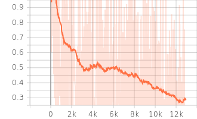

# SonicTheHedgehog2-Tensorflow2
This repository is for the Tensorflow 2 code for training the SonicTheHedgehog2 with human expert data. You need to buy the Sonic the Hedgehog 2 game from the Steam to test it. After buying it, please follow the installation tutorial of [Chang-Chia-Chi](https://github.com/Chang-Chia-Chi/Sonic-the-Hedgehog-A3C-LSTM-tensorflow2).  

The Sonic Gym environment has total 12 actions originally. Each action are ["B", "A", "MODE", "START", "UP", "DOWN", "LEFT", "RIGHT", "C", "Y", "X", "Z"] key of original game pad.

In game, we need to use only 8 combination of key like a below.

| String Key |  Binary Converted Key |
| ------------- | ------------- |
| [''] | [0, 0, 0, 0, 0, 0, 0, 0, 0, 0, 0, 0] |
| ['LEFT'] | [0, 0, 0, 0, 0, 0, 1, 0, 0, 0, 0, 0] |
| ['RIGHT'] | [0, 0, 0, 0, 0, 0, 0, 1, 0, 0, 0, 0] |
| ['A'] | [0, 1, 0, 0, 0, 0, 0, 0, 0, 0, 0, 0] |
| ['B'] | [1, 0, 0, 0, 0, 0, 0, 0, 0, 0, 0, 0] |
| ['DOWN'] | [0, 0, 0, 0, 0, 1, 0, 0, 0, 0, 0, 0] |
| ['UP'] | [0, 0, 0, 0, 1, 0, 0, 0, 0, 0, 0, 0] |
| ['B', 'LEFT'] | [1, 0, 0, 0, 0, 0, 1, 0, 0, 0, 0, 0] |
| ['B', 'RIGHT'] | [1, 0, 0, 0, 0, 0, 0, 1, 0, 0, 0, 0] |
| ['B', 'DOWN'] | [1, 0, 0, 0, 0, 1, 0, 0, 0, 0, 0, 0] |
| ['A', 'LEFT'] | [0, 1, 0, 0, 0, 0, 1, 0, 0, 0, 0, 0] |
| ['A', 'RIGHT'] | [0, 1, 0, 0, 0, 0, 0, 1, 0, 0, 0, 0] |
| ['A', 'DOWN'] | [0, 1, 0, 0, 0, 1, 0, 0, 0, 0, 0, 0] |
| ['DOWN', 'RIGHT'] | [0, 0, 0, 0, 0, 1, 0, 1, 0, 0, 0, 0] |
| ['DOWN', 'LEFT'] | [0, 0, 0, 0, 0, 1, 1, 0, 0, 0, 0, 0] |
| ['LEFT', 'RIGHT'] | [0, 0, 0, 0, 0, 0, 1, 1, 0, 0, 0, 0] |
| ['B', 'RIGHT', 'DOWN'] | [0, 1, 0, 0, 0, 1, 0, 1, 0, 0, 0, 0] |
| ['B', 'LEFT', 'DOWN'] | [1, 0, 0, 0, 0, 1, 1, 0, 0, 0, 0, 0] |
| ['A', 'LEFT', 'DOWN'] | [0, 1, 0, 0, 0, 1, 1, 0, 0, 0, 0, 0] |
| ['A', 'LEFT', 'RIGHT'] | [0, 1, 0, 0, 0, 0, 1, 1, 0, 0, 0, 0] | 
| ['A', 'RIGHT', 'DOWN'] | [0, 1, 0, 0, 0, 1, 0, 1, 0, 0, 0, 0] |
| ['B', 'LEFT', 'RIGHT'] | [1, 0, 0, 0, 0, 0, 1, 1, 0, 0, 0, 0] |
| ['DOWN', 'LEFT', 'RIGHT'] | [0, 0, 0, 0, 0, 1, 1, 1, 0, 0, 0, 0] |

According to key description, 'A', and 'B' are same key. However, I find that they show different result sometimes. 

Every key combination of replay file can be converted to them.

In this environment, Agent need to travel the map for reaching the final location by passing various traps and monsters. At some Act, Agent need to defeat the boss monster at the final point. 

# Python Dependencies
1. gym                     0.14.0
2. tensorflow-gpu          2.4.1                
3. tensorflow-probability  0.11.0
4. pygame                  1.9.6
5. gym-retro               0.8.0

# Reference
1. Gym Retro: https://github.com/openai/retro
2. Retro-movies: https://github.com/openai/retro-movies
3. Sonic-the-Hedgehog-A3C-LSTM-tensorflow2: https://github.com/Chang-Chia-Chi/Sonic-the-Hedgehog-A3C-LSTM-tensorflow2

# Human Expert Data
You can download the dataset from my [Google Drive](https://drive.google.com/drive/folders/1xmhYnhjeELmnWxPYa7oRgQmrHOldCgtJ?usp=sharing). It consists of total 1800 data for 100 number per each Act. 

| Act Name  | Sample Video |
| ------------- | ------------- |
| EmeraldHillZone.Act1 | [](https://youtu.be/Lnp8KadJW2U) |
| EmeraldHillZone.Act2 | [](https://youtu.be/tXPcWOsnqkI) |
| ChemicalPlantZone.Act1 | [](https://youtu.be/VTyPPJThAqM) |
| ChemicalPlantZone.Act2 | [](https://youtu.be/1M-jv8GW4bc) |
| MetropolisZone.Act1 | [](https://youtu.be/Go2Pb0QsGxo) |
| MetropolisZone.Act2 | [](https://youtu.be/PIgRHwKMEuQ) |
| MetropolisZone.Act3 | [](https://youtu.be/hdTzAxawO1U) |
| OilOceanZone.Act1 | [](https://youtu.be/h3dkyROZRQg) |
| OilOceanZone.Act2 | [](https://youtu.be/8EfG5IDBZGU) |
| MysticCaveZone.Act1 | [](https://youtu.be/aNRvSk2Ylg8) |
| MysticCaveZone.Act2 | [](https://youtu.be/DQmAY0ekLSE) |
| HillTopZone.Act1 | [](https://youtu.be/3iUufdoIgb0) |
| HillTopZone.Act2 | [](https://youtu.be/bG13CWnB3-Q) |
| CasinoNightZone.Act1 | [](https://youtu.be/DDy2mG8x8kw) |
| CasinoNightZone.Act2 | [](https://youtu.be/9tJEpHFq6T4) |
| WingFortressZone.Act1 | [](https://youtu.be/xu9ctWTYGr0) |
| AquaticRuinZone.Act1 | [](https://youtu.be/PZlf6hVbrbU) |
| AquaticRuinZone.Act2 | [](https://youtu.be/fuBFcSBd8v8) |

# How to run code
Please train the agent by Supervised Learning first and evaluate the performance of model. The agent should do a spin dash action properly. If it looks fine, train the model further by Reinforcement Learning.

## Running a Supervised Learning
You can use the below command for training your Agent by Supervised Learning. It will save a weight of model to the model folder of the workspace path.

```
$ python run_supervised_learning.py --workspace_path [root directory of this project] --replay_path [root directory of replay file]

$ python3.7 run_supervised_learning.py --workspace_path /home/kimbring2/Sonic-the-Hedgehog-A3C-LSTM-tensorflow2/ --replay_path /media/kimbring2/be356a87-def6-4be8-bad2-077951f0f3da/retro-movies/human/SonicTheHedgehog2-Genesis-EmeraldHillZone.Act2.Boss
```

You can the training progress by watching the Tensorboard log of the tensorboard folder of the workspace path.



## Running a Evaluation
After finishing the Supervised Learning, try to test a performance of a trained model.

```
$ python run_evaluation.py --workspace_path [root directory of this project] --model_name [Trained Model of the Supervised Learning]

$ python3.7 run_evaluation.py --workspace_path /home/kimbring2/Sonic-the-Hedgehog-A3C-LSTM-tensorflow2/ --model_name supervised_model_20900
```

# Running a Reinforcement Learning
Because of long game play time, normal A2C method can not be used because it should use whole episode once. Therefore, off-policy A2C such as [IMPALA](https://deepmind.com/research/publications/2019/impala-scalable-distributed-deep-rl-importance-weighted-actor-learner-architectures) is needed. It can restore trajectory data from buffer for training like a DQN.

You can run the IMPALA with Supervised model for the Sonic environment by below command.

```
$ ./run_reinforcement_learning.sh [number of envs] [gpu use] [pretrained model]
```

You can ignore below error of learner.py part. It does not effect the training process.

```
Traceback (most recent call last):
File "C:/minerl/learner.py", line 392, in
coord.join(thread_data)
File "C:\Users\sund0\anaconda3\envs\minerl_env\lib\site-packages\tensorflow\python\training\coordinator.py", line 357, in join
threads = self._registered_threads.union(set(threads))

where line 391 and 392 is
for thread_data in thread_data_list:
coord.join(thread_data)
```
